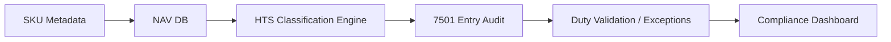
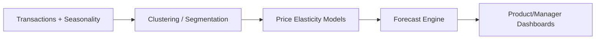
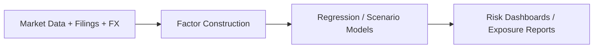
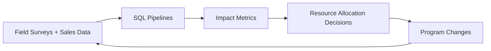

<!-- ============================== -->
<!-- HEADER / HERO SECTION          -->
<!-- ============================== -->

  

<h3 align="center">Business-Centered Data Systems • Compliance • Forecasting • Analytics</h3>

  <a href="https://chengwu-data.github.io/">Website</a> •
  <a href="mailto:cheng.w@columbia.edu">Email</a> •
  <a href="https://www.linkedin.com/in/cheng-wu-1ab27922a/">LinkedIn</a>

---

### **🔍 Who I Am**

I build data-driven systems that translate fragmented operations into scalable workflows — spanning **supply chain compliance**, **demand forecasting**, **pricing analytics**, and **portfolio risk modeling**.

My approach blends:

- **Business-first problem framing** (consulting mindset)
- **Hands-on modeling + pipeline execution** (analyst + DS)
- **Process + system design for scale** (builder/operator)

The goal isn't just running models — it's driving decision velocity, traceability, and operational leverage.

---

### **🚀 Impact Summary**

| Category | Result |
|----------|--------|
| Demand Forecasting | **12% lift** in order completion rates |
| Pipeline Optimization | **40% lower latency** via Spark/Dask |
| Compliance & Trade | Automated SKU audit workflows & duty validation |
| Finance & Deals | Analytics for **20+ PE/M&A transactions** |
| Social Impact | Data infra supporting **15 families**, +**30% income** |

---

### **📂 Projects & Systems**

> Public versions redacted for confidentiality; code released as generalizable templates.

#### **🔧 Core Systems (Cards View)**

  
  
  

#### **📊 Table View**

| Project | Description | Tech |
|---------|------------|------|
| **tarte-compliance-analytics** *(WIP)* | HTS mapping logic + 7501 audit validation pipelines | Python, SQL, PowerQuery |
| **biotech-demand-forecasting** | Elasticity experiments + Spark pipelines | Python, Spark/Dask, Scikit |
| **portfolio-risk-dashboard** | Factor models + return benchmarking | Python, SQL, Power BI |
| **social-impact-metrics** | Rural education + logistics dashboards | SQL, Dash, Logging Pipelines |

---

### **🏗 System Architecture (Diagrams)**

#### **1️⃣ Compliance / HTS + 7501 Workflow**

---

### **2️⃣ Biotech Forecasting System**

---

### **3️⃣ Portfolio Analytics System**

### **4️⃣ Social Impact Data Loop**

---

### **📓 Methodology Library**

Reusable frameworks (beyond code):

- **Commodity Code Consistency Mapping**  
  Framework for mapping HTS codes across SKU variants and regions

- **Elasticity Experimentation Protocol**  
  Systematic pricing test design (A/B + lift attribution)

- **Cross-System Reconciliation Strategy**  
  Align metadata across NAV, customs filings, logistics, and SKU catalogs

- **Impact Evaluation (Semi-Experimental)**  
  Evaluation design for development intervention outcomes

---

### **🛠 Tech Stack**

**Core Analysis**  
`Python` · `SQL` · `R`

**Infra / Pipelines**  
`Spark` · `Dask` · `AWS` · `ETL Pipelines`

**Business BI & Ops**  
`Power BI` · `Plotly` · `Dash` · `Excel/VBA`

**Domains**  
`Compliance` · `Pricing/Forecasting` · `Portfolio Analytics` · `Social Impact Data`

---

### **🧬 Language Overview**

---

### **📊 Activity (Public GitHub Only)**

Click to expand

  
  

---

### **📍 Roadmap (2025)**

**🟣 Compliance Systems**
> Scaling trade classification with validation + observability
- CI checks for HTS mapping drift
- Exception reporting for SKU onboarding

**🟣 Forecasting Infra**
> Closing the loop between pricing experiments & operational decisions
- Publish demand modeling templates
- Add seasonal elasticity dashboards

**🟣 Cross-System Alignment**
> Eliminating fragmentation across NAV / customs / product catalog
- Reconciliation CLI tool
- Metadata schema consistency rules

**🟣 Impact & Policy**
> Turning data into resource allocation decisions
- Open-source impact scoring framework
- Quantitative evaluation case studies

---

### **📫 Contact**

📧 **Email:** cheng.w@columbia.edu  
🌐 **Website:** https://chengwu-data.github.io/  
💼 **LinkedIn:** https://www.linkedin.com/in/cheng-wu-1ab27922a/

<i>Work in progress — building systems that make data useful.</i> 🚀

